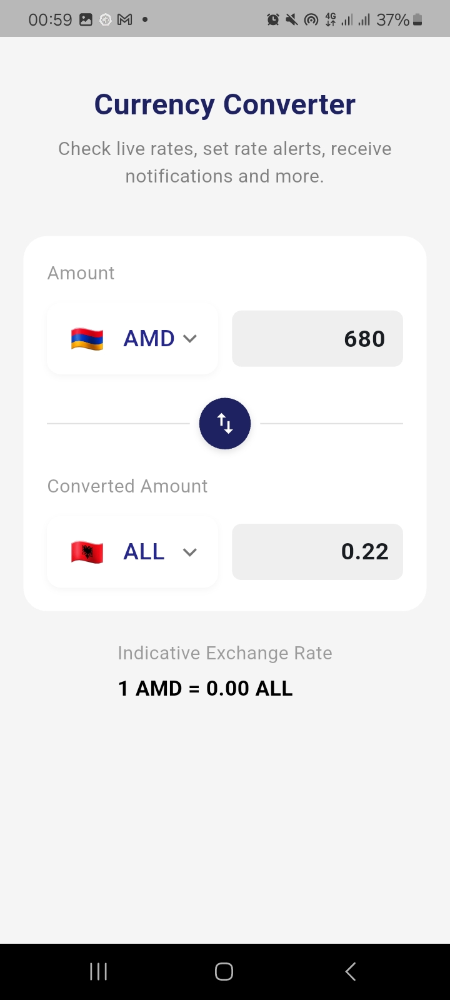
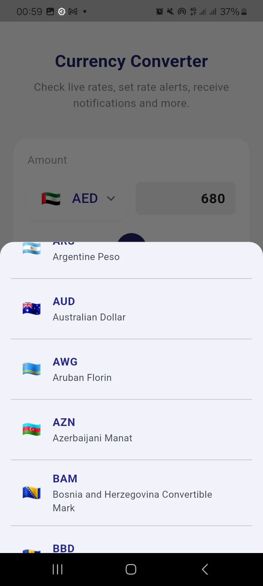

# Currency Converter App 💱

A simple, clean Flutter application that lets you **convert between currencies in real-time** using the [ExchangeRate API](https://www.exchangerate-api.com/).  
Built with **Riverpod (MVVM)**, following **KISS** and **DRY** principles for maintainable code.

---

## 🎥 Demo Video
https://github.com/user-attachments/assets/16be939e-000d-4aed-bcee-d337820ea020

👉 [Watch the demo](YOUR_VIDEO_LINK_HERE)

---

## 📸 Screenshots
<p align="center">
  
  
</p>

---


## 🚀 Live Demo
👉 [Try it out here](YOUR_DEPLOYED_LINK_HERE)

---

## 🛠️ Features
- ✅ Live currency conversion
- ✅ Clean UI with Roboto typography
- ✅ Emoji flags mapped to ISO currency codes
- ✅ Swap between currencies with one tap
- ✅ Bottom sheet currency picker
- ✅ Riverpod state management with MVVM pattern

---

## 🧑‍💻 Getting Started

1. Clone the repo:
   ```bash
   git clone https://github.com/your-username/currency_converter_app.git
   cd currency_converter_app
   flutter pub get
2. Create a .env file in the root directory Add your key:
   API_KEY=your_api_key_here
3. Run the app:
    flutter run
